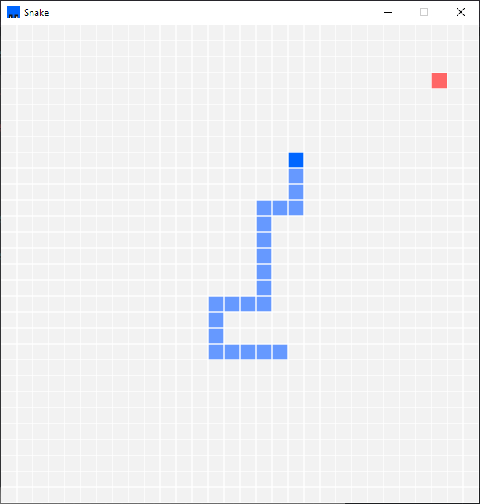

# Snake
A basic implementation of the classic Snake game in LÖVE

## Gameplay

## Controls

`↑` - Up  
`↓` - Down  
`←` - Left  
`→` - Right  
`q` - Quit  
`p` - Pause/Resume  
`g` - Enable/Disable grid, disabled by default  
`Space` - Restart on game over